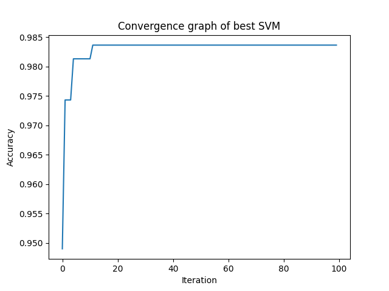

# Parameter Optimisation of SVM

## Introduction
This assignment illustrates a way of finding the optimal hyperparameter of Support Vector Classifier. The data set used here is AI4I 2020 Predictive Maintenance Dataset Data Set from UCI repository.

## Dataset
The data used contains 14 columns and 10,000 rows. It is a synthetic dataset that reflects real predictive maintenance data encountered in industry. Out of 14 columns, the following 7 columns are used:
- Type
- Air temperature
- Process Tempature
- Rotational Speed
- Torque
- Tool wear
- Machine Failure
First 6 columns are used to predict the Machine Failure.

## Methodology
The dataset is split into training and testing set for 10 times and the following SVC classifier hyperparameter are selected for best accuracy:
- **Kernel** - Selected from RBF, Polynomial, Linear and Sigmoid
-  **C (Regularisation parameter)** - Random integer values from 1 to 7
- **Gamma (Kernel coefficient)** - Random integer values from -1 to 7. If the value is less than 1, then gamma is randomly set as auto or scale. It is used only by rbf, poly and sigmoid kernel.
- **Degree** - Random integer from 1 to 5. It is only used by poly kernel and represent the degree of polynomial kernel function.

The above hyperparameters are randomly selected from the given values for 100 iterations. The parameters that gave the best accuracy for each sample are shown in table below:

| Sample| Kernel   |   c | gamma   |   degree |   Accuracy |
|------:|:---------|----:|:--------|---------:|-----------:|
|1      | rbf      |   7 | scale   |        1 |   0.976333 |
|2      | poly     |   2 | auto    |        5 |   0.978    |
|3      | rbf      |   4 | scale   |        4 |   0.981333 |
|4      | rbf      |   7 | scale   |        4 |   0.983333 |
|5      | rbf      |   6 | auto    |        3 |   0.981333 |
|6      | poly     |   3 | scale   |        5 |   0.980333 |
|7      | poly     |   6 | auto    |        5 |   0.982333 |
|8      | rbf      |   7 | scale   |        1 |   0.983667 |
|9      | rbf      |   7 | auto    |        3 |   0.980333 |
|10     | rbf      |   7 | auto    |        5 |   0.979333 |

The following Convergence graph shows the accuracy of sample 8 (maximum accuracy) over the 100 iterations:

## Result
The best parameters of SVC for the given dataset are:
- Kernel : rbf
- C : 7
- Gamma : scale
- Degree : NA
The above parameter gave a maximum accuracy of 0.983667.
